<!-- Banner -->

  

# 🛡️ Awesome Security Information & Event Management (SIEM)

  
  
  
  
  
  
  

> **A curated, battle-tested list of enterprise SaaS platforms, cloud-native SIEMs, open-source security log analytics, UEBA, and threat detection systems.**

---

## 📌 Overview & Market Context

Security Information and Event Management (**SIEM**) serves as the nerve center for modern Security Operations Centers (**SOC**). SIEM solutions ingest, correlate, and analyze log data from across cloud workloads, endpoints, network telemetry, and identity providers to detect cyber threats, automate incident response (**SOAR**), and maintain audit compliance (PCI-DSS, SOC 2, ISO 27001, HIPAA).

---

## 📑 Table of Contents

- [☁️ SaaS & Hosted Enterprise SIEM Platforms](#️-saas--hosted-enterprise-siem-platforms)
- [🔓 Open-Source SIEM & Security Analytics GitHub Projects](#-open-source-siem--security-analytics-github-projects)
- [🛠️ Complementary Detection & Collector Tools](#️-complementary-detection--collector-tools)
- [🤝 How to Contribute](#-how-to-contribute)
- [⚠️ Disclaimer & Trade-Off Analysis](#️-disclaimer--trade-off-analysis)
- [📈 Star History](#-star-history)
- [💖 Support & Sponsorship](#-support--sponsorship)

---

## ☁️ SaaS & Hosted Enterprise SIEM Platforms

> 📊 **Estimated Sector Market Size**: The global SIEM market is valued at **$5.5 Billion - $7.8 Billion in 2026** and is projected to reach **$12.5+ Billion by 2030** (CAGR ~14.5%).  
> 🏢 **Market Fragmentation**: The SIEM sector is **Moderately Fragmented**, dominated by hyperscale cloud service providers (Microsoft Sentinel, Google Chronicle) alongside specialized enterprise cybersecurity titans (Splunk/Cisco, IBM QRadar, Exabeam, Securonix).

*The table below compares top commercial SaaS SIEM solutions, sorted by **Company Size / Revenue / Valuation** in descending order:*

| Platform / Vendor | Company Size / Valuation | Starting Price (Specific Tiers) | Free Tier / Free Trial Limit | Key Focus & Primary Use Case |
| :--- | :--- | :--- | :--- | :--- |
| **[Microsoft Sentinel](https://azure.microsoft.com/en-us/products/microsoft-sentinel)** | **~$3.1 Trillion** Market Cap (Microsoft) / >$20B Security ARR | **$2.46 / GB ingested** (Pay-as-you-go); Commitment tiers start at **$1.50 / GB** (100 GB/day = $150/day) | **31-Day Free Trial** (up to 10 GB/day log ingestion free); 5 MB/user/month free M365 E5 log ingestion | Cloud-native SIEM & SOAR tightly integrated into Azure, M365, & multi-cloud enterprise logs |
| **[Google Chronicle SIEM](https://cloud.google.com/chronicle)** | **~$2.1 Trillion** Market Cap (Alphabet Inc.) | **~$45 / active user / year** or **$10 / GB ingested** (Enterprise base starts at **$25,000 / year**) | **30-Day Free Trial** on Google Cloud with **$300 in free cloud credits** | Petabyte-scale cloud log ingestion with Unified Data Model (UDM) normalization & YARA-L detection rules |
| **[Splunk Enterprise Security](https://www.splunk.com/en_us/products/enterprise-security.html)** | **~$210 Billion** Market Cap (Cisco) / $28B Acquisition | **$150 / GB / day** workload tier (**~$1,800 / month** minimum workload price) | **14-Day Free Trial** (Splunk Cloud); **60-Day Free Trial** for Splunk Enterprise (**up to 500 MB/day free forever** local ingest) | Enterprise SIEM standard with mature UEBA, correlation engine, and massive app ecosystem |
| **[IBM QRadar SIEM](https://www.ibm.com/products/qradar-siem)** | **~$200 Billion** Market Cap (IBM) / ~$2.5B Security ARR | **$1,200 / month** base SaaS package (or **$800 / month** per 50 EPS tier) | **14-Day Free Trial** with full SaaS console access & sample security telemetry | Enterprise threat intelligence, offense management, network flow analysis, and QRadar SOAR |
| **[Rapid7 InsightIDR](https://www.rapid7.com/products/insightidr/)** | **~$2.5 Billion** Market Cap (Rapid7) / ~$800M ARR | **$2.15 / asset / month** (billed annually, minimum 500 assets = **$1,075 / month**) | **30-Day Free Trial** with unlimited asset monitoring and full UEBA features | Combined SIEM + XDR with User Behavior Analytics, endpoint detection, & honeypot traps |
| **[Exabeam](https://www.exabeam.com/)** | **~$2.4 Billion** Valuation (Merged with LogRhythm 2024) | **$6.00 / user / month** (**~$2,000 / month** base platform license) | **14-Day Interactive Sandbox** trial with pre-loaded attack scenario playbooks | Advanced Behavioral Analytics (UEBA), automated incident timeline creation, & risk scoring |
| **[Sumo Logic Cloud SIEM](https://www.sumologic.com/solutions/cloud-siem/)** | **~$1.7 Billion** Valuation (Francisco Partners) / ~$300M ARR | **$2.50 / GB ingested** for Cloud SIEM package (**~$250 / month** starter commit) | **30-Day Free Trial** with **1 GB / day** ingestion limit & 30-day log data retention | Multi-tenant cloud-native SIEM built on log analytics & automated threat correlation |
| **[Securonix](https://www.securonix.com/)** | **~$1.2 Billion** Valuation (Vista Equity Partners) / ~$150M ARR | **$3.00 / GB / day** (**~$1,500 / month** entry enterprise tier) | **30-Day Sandbox Demo Trial** with up to **50 GB total ingestion limit** | Cloud-native SIEM with deep UEBA, SOAR automation, & Network Detection & Response (NDR) |
| **[LogRhythm](https://logrhythm.com/)** | **~$1.2 Billion** Valuation (Merged into Exabeam) | **$1,500 / month** starting base price for LogRhythm Axon SaaS platform | **14-Day Free Trial** of LogRhythm Axon SaaS cloud instance | Mid-market SIEM platform offering log management, simplified threat lifecycle, & SOAR |

---

## 🔓 Open-Source SIEM & Security Analytics GitHub Projects

> 🚀 **Open-Source SIEM Advantage**: Self-hosted open-source SIEM solutions provide full data sovereignty, zero ingestion vendor lock-in, customizable detection-as-code (Sigma, YARA, Python rules), and cost savings for high-volume log environments.

*The table below lists open-source SIEMs, security data lakes, and log security management platforms, sorted by **GitHub Stars_Count** in descending order:*

| Repository / Project | GitHub_Stars | License | Core Capabilities & Architecture |
| :--- | :---: | :--- | :--- |
| **[Elasticsearch (Elastic Security)](https://github.com/elastic/elasticsearch)** |  | Elastic License 2.0 / SSPL | Distributed search & analytics engine underpinning Elastic Security SIEM, built-in threat correlation, & Kibana security dashboards. |
| **[Vector](https://github.com/vectordotdev/vector)** |  | MPL-2.0 | Ultra-fast, high-performance Rust log processor and routing pipeline for SIEM ingestion, filtering, and data transformation. |
| **[Wazuh](https://github.com/wazuh/wazuh)** |  | GPLv2 | **The leading open-source SIEM & XDR platform**. Integrates HIDS, File Integrity Monitoring (FIM), rootkit detection, & 1,000+ MITRE ATT&CK rules. |
| **[OpenSearch](https://github.com/opensearch-project/OpenSearch)** |  | Apache-2.0 | Apache 2.0 community search & analytics engine with built-in Security Analytics plugin, native Sigma rule execution, & anomaly detection. |
| **[Fluentd](https://github.com/fluent/fluentd)** |  | Apache-2.0 | CNCF unified log collector & forwarder used to structure, aggregate, and ship security logs to SIEM backend storage. |
| **[Sigma Rule Standard](https://github.com/SigmaHQ/sigma)** |  | CC0-1.0 / MIT | Generic, open signature format for SIEM detection rules. Translates detection logic into Splunk, Elastic, QRadar, and SQL queries. |
| **[T-Pot Honeypot Platform](https://github.com/telekom-security/tpotce)** |  | GPLv3 | Multi-honeypot platform running Dockerized honeypots integrated with Elastic Stack SIEM for threat intelligence log collection. |
| **[Graylog Open](https://github.com/Graylog2/graylog2-server)** |  | SSPL | Centralized log management & security search platform featuring structured parsing, stream routing, & real-time alerting. |
| **[Zeek Network Security Monitor](https://github.com/zeek/zeek)** |  | BSD-3-Clause | Deep network traffic analyzer & metadata generator providing structured protocol logs for SIEM threat hunting. |
| **[Suricata NIDS](https://github.com/OISF/suricata)** |  | GPLv2 | High-performance Network Intrusion Detection (NIDS), IPS, and network security monitoring engine feeding event logs into SIEMs. |
| **[MISP Threat Intelligence](https://github.com/MISP/MISP)** |  | AGPL-3.0 | Open-source threat intelligence sharing platform (IoCs, threat actors, vulnerability indicators) integrating with SIEM platforms. |
| **[Cuckoo Sandbox](https://github.com/cuckoosandbox/cuckoo)** |  | GPLv3 | Automated malware analysis system generating forensic behavioral logs for SOC incident triage & SIEM correlation. |
| **[OSSEC HIDS](https://github.com/ossec/ossec-hids)** |  | GPLv2 | Open-source Host Intrusion Detection System providing log analysis, file integrity monitoring (FIM), and active response. |
| **[Security Onion](https://github.com/Security-Onion-Solutions/securityonion)** |  | GPLv3 | Complete Linux distribution for threat hunting, enterprise security monitoring, network metadata, full packet capture, & log management. |
| **[TheHive Incident Response](https://github.com/TheHive-Project/TheHive)** |  | AGPL-3.0 | Scalable 4-in-1 Security Incident Response Platform (SIRP/SOAR) designed to ingest SIEM alerts & streamline analyst investigations. |
| **[Snort 3 NIPS](https://github.com/snort3/snort3)** |  | GPLv2 | Next-generation network intrusion prevention system sending real-time attack events and anomaly telemetry to SIEM collectors. |
| **[Shuffle SOAR](https://github.com/Shuffle/Shuffle)** |  | CC-BY-4.0 | Open-source Security Orchestration, Automation, and Response (SOAR) platform for workflow automation with SIEMs. |
| **[Matano Data Lake SIEM](https://github.com/matanolabs/matano)** |  | Apache-2.0 | Serverless AWS-native security data lake SIEM storing Apache Iceberg Parquet files on S3 with Python detection-as-code. |
| **[Panther Analysis Rules](https://github.com/panther-labs/panther-analysis)** |  | Apache-2.0 | Public detection-as-code repository containing Python detection rules and schemas for Panther cloud security analytics. |

---

## 🛠️ Complementary Detection & Collector Tools

While not standalone SIEMs, these critical security utilities feed essential telemetry into SIEM indexers:

- **[Snort 3](https://github.com/snort3/snort3)** — Network IDS/IPS for packet inspection & protocol analysis.
- **[Suricata](https://github.com/OISF/suricata)** — Multi-threaded network threat monitoring engine.
- **[Zeek](https://github.com/zeek/zeek)** — Protocol metadata parser delivering structured JSON network logs.
- **[Vector](https://github.com/vectordotdev/vector)** — Lightweight log transform & streaming pipeline.
- **[Fluentd](https://github.com/fluent/fluentd)** — Universal log collector and shipper.

---

## 🤝 How to Contribute

Contributions are warmly welcomed! Please follow these simple steps:

1. **Fork** this repository.
2. Create your feature branch (`git checkout -b feature/add-new-siem`).
3. Add your entry under the corresponding table in proper alphabetical or metric order.
4. Ensure factual descriptions, exact link URLs, and verified pricing/star metrics.
5. Submit a **Pull Request** with a brief summary of additions.

See our awesome list guidelines at **[Awesome-Awesome-Awesome](https://github.com/ishandutta2007/Awesome-Awesome-Awesome)**.

---

## ⚠️ Disclaimer & Trade-Off Analysis

> 💡 **Engineering Overhead vs SaaS Cost**: Open-source SIEMs require ongoing infrastructure management (index lifecycle management, rule tuning, agent patching). A senior security engineer dedicated to maintaining open-source SIEM infrastructure typically costs more annually than mid-tier commercial SaaS licenses.

- **Data Privacy**: SIEM platforms process high-density security logs that may contain PII or secret credentials. Ensure data masking and access controls.
- **Hardware Sizing**: Security Onion standalone nodes require a minimum of 24 GB RAM (32 GB+ recommended). Wazuh single-node requires 8 vCPUs / 16 GB RAM for 5,000–10,000 Events Per Second (EPS).
- **Maintenance Windows**: Ensure support windows for self-hosted components (e.g., Graylog versions 6.2/6.3 reach EOL by mid-2026).

---

## 📈 Star History

---

## 💖 Support & Sponsorship

Thank you for exploring the **Awesome Security Information & Event Management (SIEM)** repository! If this resource has helped your SOC team, security research, or infrastructure design, please consider supporting the project:

- 🌟 **Star this repository** to help others discover it.
- 🔀 **Fork and share** it with your fellow security analysts and DevOps engineers.
- ☕ **Sponsor / Buy me a coffee**: Support ongoing maintenance and curated security tooling lists via the [GitHub Sponsor Dashboard](https://github.com/sponsors/ishandutta2007).

  

---

  <i>Made with ❤️ for security analysts, threat hunters, and SOC engineering teams worldwide.</i>

